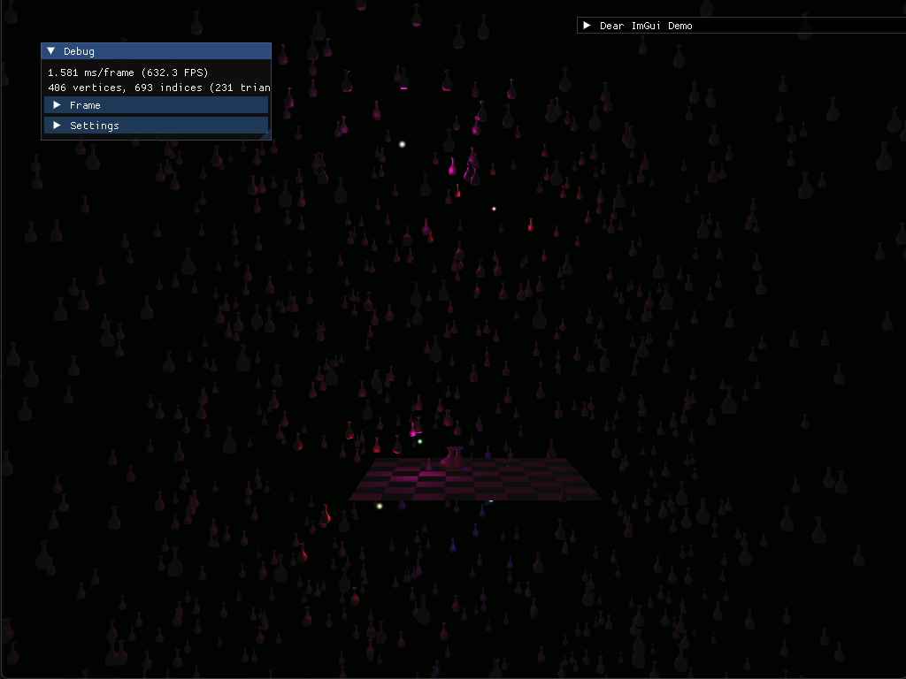

# Vulkan Game Engine

This is a  C++ learning project. It is based on [Little Vulkan Engine](https://github.com/blurrypiano/littleVulkanEngine).

I implemented:
- Entity Component System
- Loading Textures
- AABB
- Drawing Lines
- Parallel loading of assets (separate thread)
- Saving and Loading the game (F5,F7) as binary data
- Integrate GLM
- Integrate ImGui
- Integrate FastGLTF
- Integrate JoltPhysics (WIP)
- Loading GLTF (WIP)

# Compiling

## Requirements:

- Install C++ Compiler (Visual Studio on Windows)
- Install CMake
- Install Python and Pip
- Install invoke package `pip install invoke`

Linux only:
- Install [Ninja Build System](https://github.com/ninja-build/ninja/wiki/Pre-built-Ninja-packages)

## Compile and run the project
(open a `Developer Powershell for Visual Studio` on Windows):
`invoke config`

`invoke build`

`invoke run`

`invoke --help` for descriptions of the available tasks

For Windows clients a Visual Studio Solution is also generated. A compile_commands.json for LSPs is linked into the root directory (Linux only atm or if you force it with: invoke config --forceninja; invoke build --forceninja).